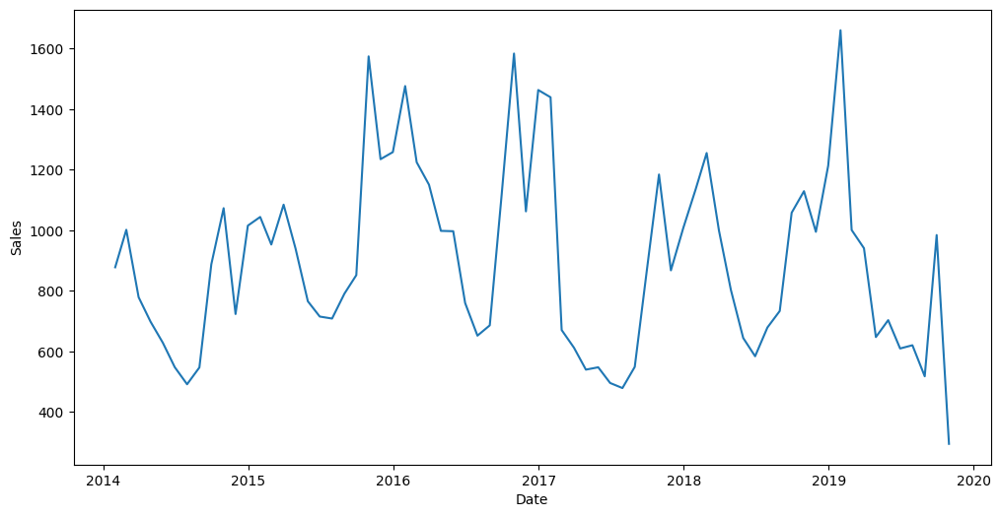
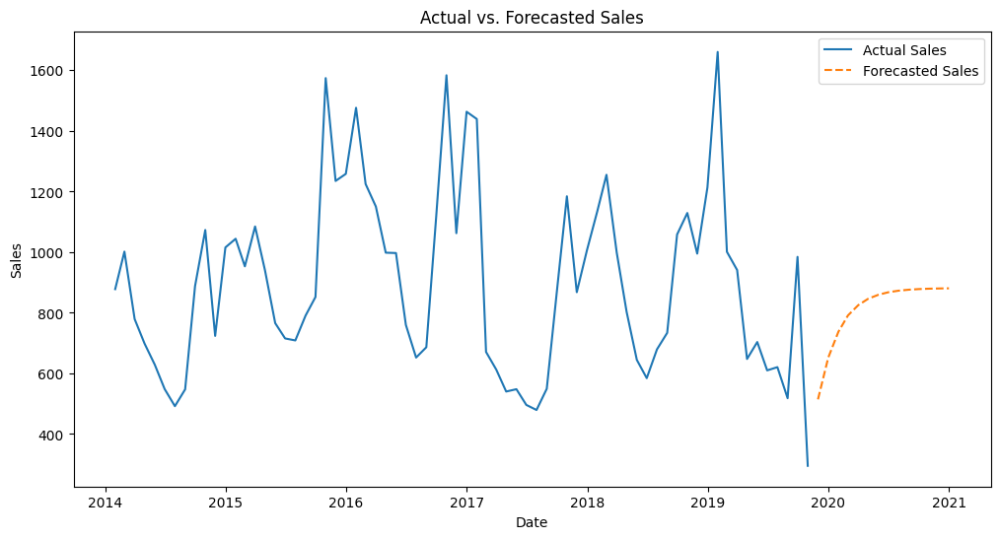

# Pharma-sales-prediction

We found a pharmaceutical dataset from Kaggle. We have to analyze and build a predictive model for the most sold product in that Pharmacy 

## Table of Contents

- [Introduction](#pharmaceutical-sales-analysis-and-sales-prediction)
- [Installation](#installation)
- [Usage](#usage)
- [Data Sources](#data-sources)
- [Analysis](#analysis)
- [Sales Prediction](#sales-prediction)
- [Results](#results)

## Introduction

This project aims to provide insights into pharmaceutical sales trends and forecast the sales of the most sold product within the industry. 
It utilizes data analysis and machine learning techniques to assist stakeholders in making informed decisions regarding product sales strategies.

## Installation

To set up the project locally, follow these steps:

1. Clone this repository:
## Installation

To set up the project locally, follow these steps:

1. Clone this repository:
2. ## Installation

To set up the project locally, follow these steps:

1. Clone this repository:

2. Install the required Python packages:

## Usage

To perform pharmaceutical sales analysis and predict the sales of the most sold product, follow these steps:

1. Prepare and preprocess your pharmaceutical sales data, ensuring it follows the required format.

2. Run the data analysis scripts:

3. Utilize the machine learning model for sales prediction:

4. Explore the results and visualizations generated by the analysis and prediction processes.

## Data Sources

The project uses pharmaceutical sales data obtained from reliable sources The data I have added to this repository or you can find this from the kaggle. 
Ensure that your data is up-to-date and relevant to the analysis.

### Overview of the data
Number of rows:  2106

Features:  13

Columns: 
 ['datum', 'M01AB', 'M01AE', 'N02BA', 'N02BE', 'N05B', 'N05C', 'R03', 'R06', 'Year', 'Month', 'Hour', 'Weekday Name']
<class 'pandas.core.frame.DataFrame'>
RangeIndex: 2106 entries, 0 to 2105
Data columns (total 13 columns):
 #   Column        Non-Null Count  Dtype  
---  ------        --------------  -----  
 0   datum         2106 non-null   object 
 1   M01AB         2106 non-null   float64
 2   M01AE         2106 non-null   float64
 3   N02BA         2106 non-null   float64
 4   N02BE         2106 non-null   float64
 5   N05B          2106 non-null   float64
 6   N05C          2106 non-null   float64
 7   R03           2106 non-null   float64
 8   R06           2106 non-null   float64
 9   Year          2106 non-null   int64  
 10  Month         2106 non-null   int64  
 11  Hour          2106 non-null   int64  
 12  Weekday Name  2106 non-null   object 
dtypes: float64(8), int64(3), object(2)
memory usage: 214.0+ KB

Column Dtypes: 

 None

Statistical Details: 
              M01AB        M01AE        N02BA        N02BE         N05B  \
count  2106.000000  2106.000000  2106.000000  2106.000000  2106.000000   
mean      5.033683     3.895830     3.880441    29.917095     8.853627   
std       2.737579     2.133337     2.384010    15.590966     5.605605   
min       0.000000     0.000000     0.000000     0.000000     0.000000   
25%       3.000000     2.340000     2.000000    19.000000     5.000000   
50%       4.990000     3.670000     3.500000    26.900000     8.000000   
75%       6.670000     5.138000     5.200000    38.300000    12.000000   
max      17.340000    14.463000    16.000000   161.000000    54.833333   

              N05C          R03          R06         Year        Month  \
count  2106.000000  2106.000000  2106.000000  2106.000000  2106.000000   
mean      0.593522     5.512262     2.900198  2016.401235     6.344255   
std       1.092988     6.428736     2.415816     1.665060     3.386954   
min       0.000000     0.000000     0.000000  2014.000000     1.000000   
25%       0.000000     1.000000     1.000000  2015.000000     3.000000   
50%       0.000000     4.000000     2.000000  2016.000000     6.000000   
75%       1.000000     8.000000     4.000000  2018.000000     9.000000   
max       9.000000    45.000000    15.000000  2019.000000    12.000000   

              Hour  
count  2106.000000  
mean    275.945869  
std       1.970547  
min     190.000000  
25%     276.000000  
50%     276.000000  
75%     276.000000  
max     276.000000  

Missing values:  0

Number of unique values: 
 datum           2106
M01AB            218
M01AE            694
N02BA            199
N02BE            713
N05B              77
N05C              20
R03               64
R06               98
Year               6
Month             12
Hour               3
Weekday Name       7

## Analysis

We employ data analysis techniques to gain insights into pharmaceutical sales trends, including seasonality, product performance, and market dynamics.

Based on the analysis we found the most sold product in the store is N02BE which is Other analgesics and antipyretics, Pyrazolones, and Anilides.
So we are going to build a model on that to focus on the next sale of that product 

## Sales Prediction

Our sales prediction model leverages machine learning algorithms to forecast the sales of the most sold product. 
It takes into account historical data and relevant features to make accurate predictions.

This is a time series data so we use ### ARIMA model

## Results

View the analysis findings, visualizations, and sales prediction results in the output files generated during the analysis process.

we use 1 1 1 as p d q values we got 96% accuracy on the test data we have given 

# Vizualising prediction 

